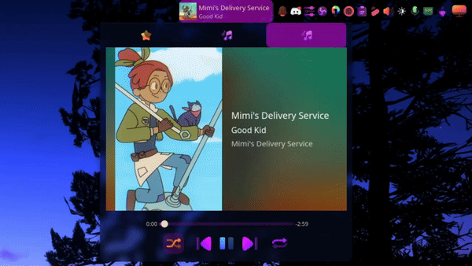
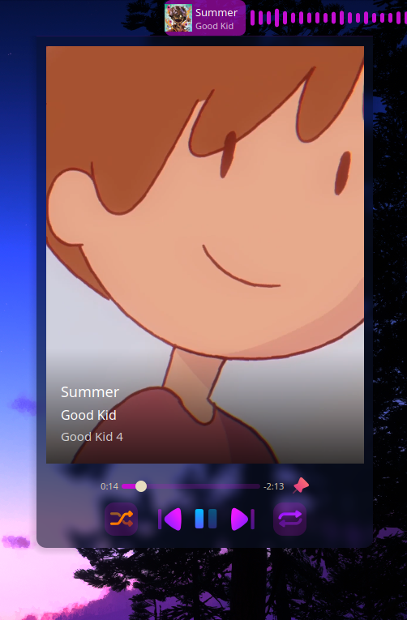

# KanvasPlayer

A Plasma media player widget that shows the animated Spotify Canvas video
for the currently playing track in its expanded view, instead of static
album art. Falls back to album art automatically for tracks that don't
have a Canvas.

<table>
<tr>
<td align="center"><br>Normal mode</td>
<td align="center"><br>Compact mode</td>
</tr>
</table>

## What this actually is

Spotify's own desktop client shows these looping Canvas videos, but
there's no public API for them and no way to surface them anywhere
outside Spotify's own UI. KanvasPlayer reproduces that experience inside
a real Plasma panel widget.

It's two independent pieces that only ever talk to each other through a
file on disk:


- **[`kanvasd/`](kanvasd)** - the backend. Watches Spotify over MPRIS for
  track changes, extracts a Bearer token straight out of Spotify's own
  DevTools protocol (no login, no API key, no OAuth flow - it's reading
  a session that's already authenticated on your machine), and downloads
  the Canvas video for whatever's currently playing. Caches recent
  canvases, retries once on a rejected token, and idles at effectively
  zero cost whenever Spotify isn't running.
- **[`plasmoid/`](plasmoid)** - the frontend. A fork of KDE's own Media
  Player widget that overlays the fetched video on top of the normal
  album art whenever one is available, and falls back cleanly to plain
  album art otherwise. Has an optional **compact mode** (right-click →
  Configure → Appearance) that shows the canvas video full-bleed with
  the track info overlaid, instead of a separate box next to it.

Neither side knows the other exists beyond that one file path
(`~/.cache/kanvasd/current.mp4`). The widget doesn't know how the video
got there; `kanvasd` doesn't know or care whether anything is watching
it. Either half can be replaced independently.

## Install

```sh
git clone https://github.com/KenzieOSS/KanvasPlayer/
cd KanvasPlayer
chmod +x install.sh
./install.sh
```

If the widget does not work immediately after adding it somewhere, opening Spotify and starting a song a reboot should fix it

That's genuinely most of it - it sets up the daemon, its systemd
service, and the widget itself, and will offer to patch Spotify's
launcher with the one flag it needs. See [`kanvasd/README.md`](kanvasd/README.md)
and [`plasmoid/README.md`](plasmoid/README.md) if you want the manual
steps instead, or to see exactly what the installer is doing on your
behalf before you run it.

## Disclaimer
The flags that Spotify needs for this to work cause a minor security flaw, allwoing any websocket to connect to Spotify's backend
Also this project is quite fragile a single update from Spotify changing stuff about how canvases work can break it at any moment

## Requirements

- KDE Plasma 6
- Qt6 with QtMultimedia
- Python 3.11+
- [Bun](https://bun.sh) (the installer will fetch this for you if missing)
- Spotify desktop client (Linux, CEF/Electron-based)

## Credits / license

The Canvas video fetcher, `kanvasd/mrn4txt.ts`, was written by
[yaaaarn](https://github.com/yaaaarn).

`plasmoid/` is a fork of KDE's `org.kde.plasma.mediacontroller`
(© Sebastian Kügler, Kai Uwe Broulik, Marco Martin, Ismael Asensio,
Carson Black, Fushan Wen, and other KDE contributors), licensed
GPL-2.0-or-later / LGPL-2.0-or-later per-file - original SPDX headers are
preserved in each file. The "-or-later" grant is what permits including
them here: this repo as a whole, and all new/modified files in it, are
licensed GPL-3.0-only.

This project is unaffiliated with Spotify or KDE. It relies on
reverse-engineered, undocumented Spotify endpoints that may change or
break without notice, and on extracting your own session token from your
own locally running Spotify client - see `kanvasd/README.md` for details
on how that works.
